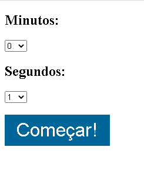

# Cronômetro de minutos e segundos!

<table>
  <tr>
    <td>HTML</td>
    <td>JavaScript</td>
    <td>Css</td>
  </tr>
   
  <tr>
    <td>5.1</td>
    <td>2022</td>
    <td>3.0</td>
  </tr>
</table>

## Como rodar a aplicação:
<ul>
<li>Defina os minutos que deseja, ex:60 minutos
<li>Defina os segundos que deseja, ex:60 segundos
<li>E em seguida aperte no botão COMEÇAR!
<li>Agora só esperar que o alarme irá avisar quando chegar no tempo determinado.
</ul>
